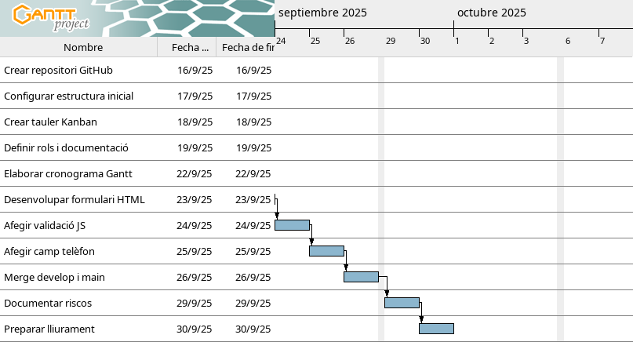

# Ecommerce-PI

## Objectiu
Pràctica final de **Git + GitHub + VS Code + Formulari Web**, amb l’objectiu de gestionar un projecte col·laboratiu i documentar tot el procés.

---

## Estructura del projecte

```
Ecommerce-PI/
├── frontend/
│ ├── index.html
│ └── validacio.js
├── backend/
├── database/
├── docs/
│ ├── gantt-SA1.png
│ └── rols.md
├── .gitignore
├── README.md
└── docker-compose.yml
```

---

## Cronograma (Gantt)
Cronograma inicial elaborat amb **GanttProject** i exportat a `docs/gantt-SA1.png`.



---

## Organització del projecte (Kanban)
- **Tauler Kanban** creat amb **GitHub Projects** amb columnes: *To do / In progress / Done*.
- Cada tasca és una **issue** amb labels i deadlines.
- Exemples de issues:
  - Crear estructura inicial (#1)
  - Formulari HTML (#2)
  - Validació JS (#3)

